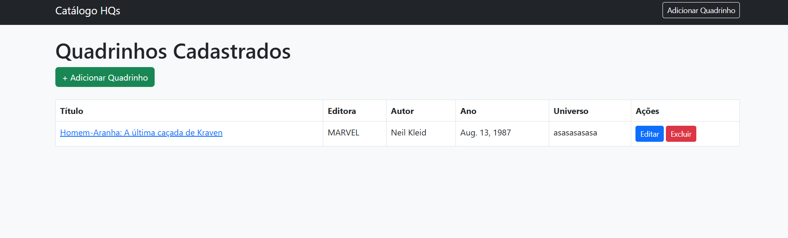
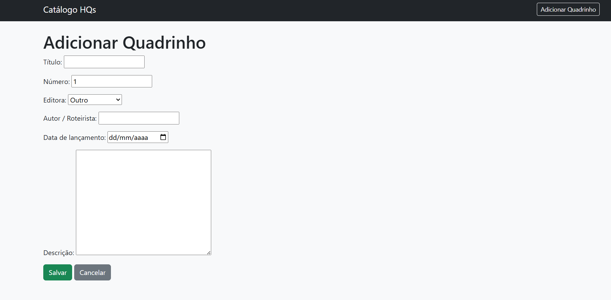
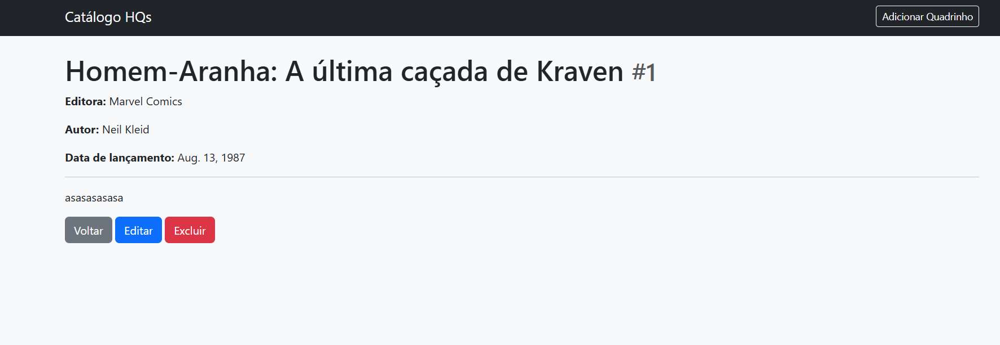
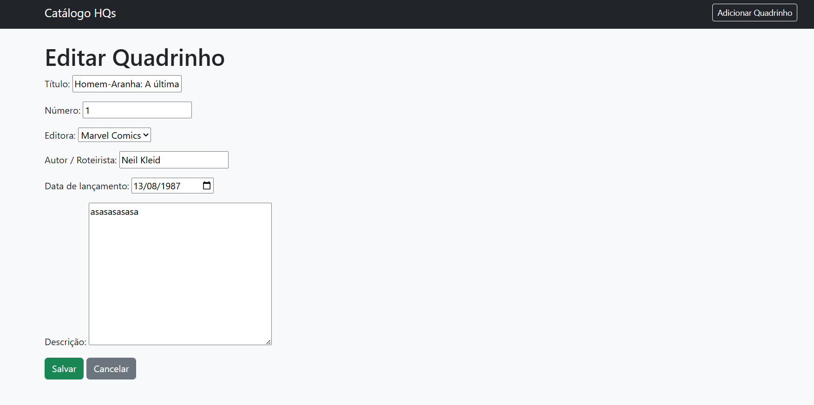
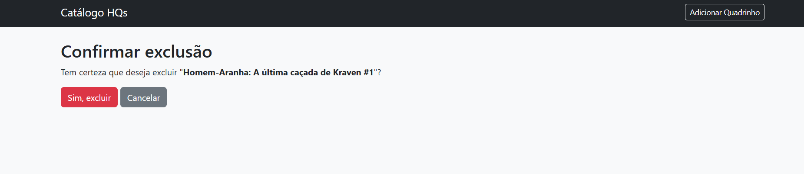

# Catálogo de Quadrinhos - Sistema Django com Class-Based Views

Sistema web completo desenvolvido em Django utilizando Class-Based Views (CBV) para gerenciamento de um catálogo de quadrinhos. O projeto implementa operações CRUD completas com interface moderna e responsiva.

## 📋 Índice

- [Funcionalidades](#funcionalidades)
- [Tecnologias Utilizadas](#tecnologias-utilizadas)
- [Estrutura do Projeto](#estrutura-do-projeto)
- [Pré-requisitos](#pré-requisitos)
- [Como Executar](#como-executar)
- [Prints das Telas](#prints-das-telas)

---

## 🚀 Funcionalidades

✅ **CRUD Completo**

- **Create**: Adicionar novos quadrinhos com formulário validado  
- **Read**: Listar e visualizar detalhes dos quadrinhos  
- **Update**: Editar informações dos quadrinhos existentes  
- **Delete**: Remover quadrinhos com confirmação  

🎨 **Interface**

- Design responsivo com Bootstrap 5  
- Layout moderno e intuitivo  
- Navegação simplificada entre páginas  
- Mensagens de estado vazio  

📊 **Gestão de Dados**

- 6 campos por quadrinho (título, número, editora, autor, data de lançamento, descrição)  
- Validação de dados nos formulários  
- Armazenamento seguro de arquivos de mídia (se utilizar imagens)  

---

## 🛠 Tecnologias Utilizadas

**Backend**

- Django 5.x: Framework web principal  
- Python 3.11+: Linguagem de programação  
- SQLite: Banco de dados para desenvolvimento  

**Frontend**

- Bootstrap 5: Framework CSS  
- HTML5 e CSS3: Estrutura e estilos das páginas  

**Ferramentas**

- Git: Controle de versão  
- GitHub: Hospedagem do código  
- PIP: Gerenciamento de pacotes  

---

## 📂 Estrutura do Projeto

catalogo/ # Aplicação principal
├─ migrations/ # Migrações do banco
├─ templates/catalogo/ # Templates HTML
│ ├─ base.html
│ ├─ listar.html
│ ├─ detalhe.html
│ ├─ form.html
│ └─ confirm_delete.html
├─ admin.py # Configuração admin
├─ models.py # Model Quadrinho
├─ urls.py # URLs do app
└─ views.py # Class-Based Views
media/ # Arquivos de mídia (opcional)
static/ # Arquivos estáticos
manage.py # Gerenciador do Django
requirements.txt # Dependências do projeto
README.md

yaml
Copiar código

---

## ⚙ Pré-requisitos

- Python 3.8 ou superior  
- PIP (gerenciador de pacotes Python)  
- Git (para clone do repositório)  
- Navegador web moderno  

---

## 🎯 Como Executar

1. Clone o repositório:

```bash
git clone https://github.com/seuusuario/atividade-crud-quadrinhos.git
Entre na pasta do projeto:

bash
Copiar código
cd Atividade-Crud
Instale as dependências:

bash
Copiar código
pip install -r requirements.txt
Execute as migrações do banco:

bash
Copiar código
python manage.py migrate
Crie um superusuário (opcional, para acessar o admin):

bash
Copiar código
python manage.py createsuperuser
Inicie o servidor:

bash
Copiar código
python manage.py runserver
Acesse no navegador:

cpp
Copiar código
http://127.0.0.1:8000/

🖼 Prints das Telas









